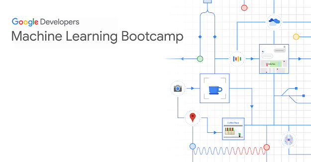
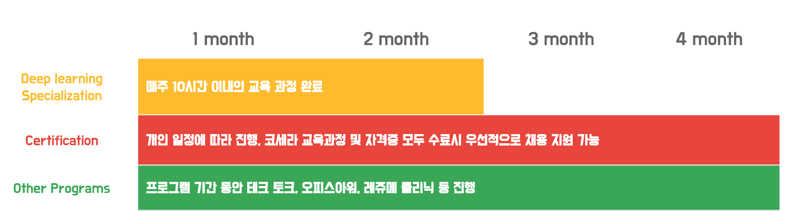

# Google Machine Learning Bootcamp

구글 머신 러닝 부트캠프 : 일반 개발자가 머신 러닝 개발자로 성장할 수 있도록 머신 러닝 교육을 제공하는 프로그램

## Overview
- 왜 이런 프로그램을 기획하게 되었나요?
	> 머신 러닝 관련 소프트웨어와 플랫폼의 발전으로 인해 머신 러닝 개발 장벽이 많이 낮아졌으나 기존 소프트웨어 기술과는 다른 점이 많아 개발자들은 공부하기가 상대적으로 쉽지 않고, 기업들은 여전히 관련 인력 채용에 어려움을 겪고 있습니다. 이 프로그램은 머신러닝 기술 습득은 물론이고 채용 이후 참여 기업의 현업 과제에 곧바로 투입되므로 개발자와 기업 모두에게 직접적으로 도움이 되는 기회가 될 것입니다.
	>
	> *권순선. Google Global ML Ecosystem Program Lead*

- 프로그램 개요
	- 머신러닝 이론 과정 수료
		- [Deep Learning Specialization](https://www.coursera.org/specializations/deep-learning) by Andrew Ng
	- 머신 러닝 자격증 취득 및 관련 코스 이수 : 다음 세 자격 **중 택일**
		- [TensorFlow certification](https://www.tensorflow.org/certificate)
		- [GCP Professional Data Engineer certification](https://cloud.google.com/certification/data-engineer)
		- [GCP Professional ML Engineer certification](https://cloud.google.com/certification/machine-learning-engineer)
	- 머신러닝 네트워크 형성
		- 테크 토크
		- 커리어 세션
		- 멘토링
		- 참가자 커뮤니티 등

## Schedule

 
딥러닝 이론과정 수료 + 자격증 취득까지 총 4개월 소요

## 1. Learning - Deep Learning Specialization
[Deep Learning Specialization](https://www.coursera.org/specializations/deep-learning) by Andrew Ng 과정을 수료하는 것을 목표로, 약 두 달 간 공부합니다.

### 학습 스케줄
| 미션 | 시작일 | 마감일 | 강좌 | 강의 계획 | 권장 소요 시간 | 동영상 수 | 총 동영상 시간 |
| -- | --- | --- | -- | -----  | ---------- | -------- | ------- |
| 1주차 | 2020/10/16 | 2020/10/22 | [1st course: Neural Networks and Deep Learning](https://www.coursera.org/learn/neural-networks-deep-learning?specialization=deep-learning) | Introduction to deep learning | 2 | 7 | 76 |
| 1주차 | 2020/10/16 | 2020/10/22 | [1st course: Neural Networks and Deep Learning](https://www.coursera.org/learn/neural-networks-deep-learning?specialization=deep-learning) | Neural Networks Basics | 8 | 19 | 161 |
| 2주차 | 2020/10/23 | 2020/10/29 | [1st course: Neural Networks and Deep Learning](https://www.coursera.org/learn/neural-networks-deep-learning?specialization=deep-learning) | Shallow neural networks | 5 | 12 | 109 |
| 2주차 | 2020/10/23 | 2020/10/29 | [1st course: Neural Networks and Deep Learning](https://www.coursera.org/learn/neural-networks-deep-learning?specialization=deep-learning) | Deep neural networks | 5 | 8 | 64 |
| 3주차 | 2020/10/30 | 2020/11/05 | [2nd course: Improving Deep Neural Networks: Hyperparameter tuning, Regularization and Optimization](https://www.coursera.org/learn/deep-neural-network?specialization=deep-learning) | Partial aspects of Deep Learning | 8 | 15 | 131 |
| 4주차 | 2020/11/06 | 2020/11/12 | [2nd course: Improving Deep Neural Networks: Hyperparameter tuning, Regularization and Optimization](https://www.coursera.org/learn/deep-neural-network?specialization=deep-learning) | Optimization algorithms | 5 | 11 | 92 |
| 4주차 | 2020/11/06 | 2020/11/12 | [2nd course: Improving Deep Neural Networks: Hyperparameter tuning, Regularization and Optimization](https://www.coursera.org/learn/deep-neural-network?specialization=deep-learning) | Hyperparameter tuning, Batch Normalization and Programming Frameworks | 5 | 11 | 104 |
| 5주차 | 2020/11/13 | 2020/11/19 | [3rd course: Structuring Machine Learning Projects](https://www.coursera.org/learn/machine-learning-projects?specialization=deep-learning) | ML Strategy(1) | 2 | 13 | 100 |
| 5주차 | 2020/11/13 | 2020/11/19 | [3rd course: Structuring Machine Learning Projects](https://www.coursera.org/learn/machine-learning-projects?specialization=deep-learning) | ML Strategy(2) | 3 | 11 | 132 |
| 5주차 | 2020/11/13 | 2020/11/19 | [4th course: Convolutional Neural Networks](https://www.coursera.org/learn/convolutional-neural-networks?specialization=deep-learning) | Foundations of Convolutional Neural Networks | 6 | 12 | 140 |
| 6주차 | 2020/11/20 | 2020/11/26 | [4th course: Convolutional Neural Networks](https://www.coursera.org/learn/convolutional-neural-networks?specialization=deep-learning) | Deep convolutional models: case studies | 5 | 11 | 99 |
| 6주차 | 2020/11/20 | 2020/12/26 | [4th course: Convolutional Neural Networks](https://www.coursera.org/learn/convolutional-neural-networks?specialization=deep-learning) | Object Detection | 4 | 10 | 85 |
| 7주차 | 2020/11/27 | 2020/12/03 | [4th course: Convolutional Neural Networks](https://www.coursera.org/learn/convolutional-neural-networks?specialization=deep-learning) | Special applications: Face recognition & Neural style transfer | 6 | 11 | 76 |
| 7주차 | 2020/11/27 | 2020/12/03 | [5th course: Sequence Models](https://www.coursera.org/learn/nlp-sequence-models) | Recurrent Neural Networks | 6 | 12 | 112 |
| 8주차 | 2020/12/04 | 2020/12/10 | [5th course: Sequence Models](https://www.coursera.org/learn/nlp-sequence-models) | Natural Language Processing & Word Embeddings | 4 | 10 | 102 |
| 8주차 | 2020/12/04 | 2020/12/10 | [5th course: Sequence Models](https://www.coursera.org/learn/nlp-sequence-models) | Sequence models & Attention mechanism | 5 | 11 | 103 |

### Programming Assignment
각 코스 및 수료해야하는 강좌별로 프로그래밍 과제를 한국어로 번역하였습니다.
부트캠프 프로그램 정책 및 코세라 정책 상 프로그래밍 과제의 소스 코드를 공유하는 것이 제한되어 있어, 번역본만 공유하도록 하겠습니다.

**이 작업은 구글 머신러닝 부트캠프와는 별개의 작업으로, 작성자 본인이 임의로 번역한 내용입니다**

#### 1st course : Neural Networks and Deep Learning
- week2
	1. [Logistic_Regression_with_a_Neural_mindset_Kor_ipynb](https://github.com/skfo763/Google-ML-Bootcamp/blob/main/phase1/course1/week2/Logistic_Regression_with_a_Neural_Network_mindset_Kor.ipynb)
- week3
	1. [Planar_data_classification_with_onehidden_layer_v6c.ipynb](https://github.com/skfo763/Google-ML-Bootcamp/blob/main/phase1/course1/week3/Planar_data_classification_with_onehidden_layer_v6c.ipynb)
- week4
	1. [Building_your_Deep_Neural_Network_Step_by_Step_v8a.ipynb](https://github.com/skfo763/Google-ML-Bootcamp/blob/main/phase1/course1/week4/Building_your_Deep_Neural_Network_Step_by_Step_v8a.ipynb)
	2. [Deep_Neural_Network_Application_v8_ipynb](https://github.com/skfo763/Google-ML-Bootcamp-phase1/tree/main/course1/week4)

#### 2nd course : Improving Deep Neural Networks: Hyperparameter tuning, Regularization and Optimization
- week1
	1. [Gradient_Checking_v1.ipynb](https://github.com/skfo763/Google-ML-Bootcamp/blob/main/phase1/course2/week1/Gradient_Checking_v1.ipynb)
	2. [Initialization.ipynb](https://github.com/skfo763/Google-ML-Bootcamp/blob/main/phase1/course2/week1/Initialization.ipynb)
	3. [Regularization_v2a.ipynb](https://github.com/skfo763/Google-ML-Bootcamp/blob/main/phase1/course2/week1/Regularization_v2a.ipynb)
- week2
	1. [Optimization_methods_v1b.ipynb](https://github.com/skfo763/Google-ML-Bootcamp/blob/main/phase1/course2/week2/Optimization_methods_v1b.ipynb)
- week3
	1. [TensorFlow_Tutorial_v3b.ipynb](https://github.com/skfo763/Google-ML-Bootcamp/blob/main/phase1/course2/week3/TensorFlow_Tutorial_v3b.ipynb)

#### 3 3rd course : Structuring Machine Learning Projects
세 번째 코스에는 과제가 없습니다

#### 4. 4th course : Convolutional Neural Networks
- week1
	1. [Convolution_model_Application_v1a.ipynb](https://github.com/skfo763/Google-ML-Bootcamp/blob/main/phase1/course4/week1/Convolution_model_Application_v1a.ipynb)
	2. [Convolution_model_Step_by_Step_v2a.ipynb](https://github.com/skfo763/Google-ML-Bootcamp/blob/main/phase1/course4/week1/Convolution_model_Step_by_Step_v2a.ipynb)
- week2
	1. [Keras_Tutorial_v2a.ipynb](https://github.com/skfo763/Google-ML-Bootcamp/blob/main/phase1/course4/week2/Keras_Tutorial_v2a.ipynb)
	2. [Residual_Networks_v2a.ipynb](https://github.com/skfo763/Google-ML-Bootcamp/blob/main/phase1/course4/week2/Residual_Networks_v2a.ipynb)
- week3
	1. [Autonomous_driving_application_Car_detection_v3a.ipynb](https://github.com/skfo763/Google-ML-Bootcamp/blob/main/phase1/course4/week3/Autonomous_driving_application_Car_detection_v3a.ipynb)
- week4
	1. [Art_Generation_with_Neural_Style_Transfer_v3a.ipynb](https://github.com/skfo763/Google-ML-Bootcamp/blob/main/phase1/course4/week4/Art_Generation_with_Neural_Style_Transfer_v3a.ipynb "Art_Generation_with_Neural_Style_Transfer_v3a.ipynb")
	2. [Face_Recognition_v3a.ipynb](https://github.com/skfo763/Google-ML-Bootcamp/blob/main/phase1/course4/week4/Face_Recognition_v3a.ipynb)

#### 5. 5th course : Sequence Models
- week1
	1. [Building_a_Recurrent_Neural_Network_Step_by_Step_v3b.ipynb](https://github.com/skfo763/Google-ML-Bootcamp/blob/main/phase1/course5/week1/Building_a_Recurrent_Neural_Network_Step_by_Step_v3b.ipynb)
	2. [Dinosaurus_Island_Character_level_language_model_final_v3b.ipynb](https://github.com/skfo763/Google-ML-Bootcamp/blob/main/phase1/course5/week1/Dinosaurus_Island_Character_level_language_model_final_v3b.ipynb)
	3. [Improvise_a_Jazz_Solo_with_an_LSTM_Network_v3a.ipynb](https://github.com/skfo763/Google-ML-Bootcamp/blob/main/phase1/course5/week1/Improvise_a_Jazz_Solo_with_an_LSTM_Network_v3a.ipynb)
- week2
	1. [Operations_on_word_vectors_v2a.ipynb](https://github.com/skfo763/Google-ML-Bootcamp/blob/main/phase1/course5/week2/Operations_on_word_vectors_v2a.ipynb)
	2. [Emojify!.ipynb](https://github.com/skfo763/Google-ML-Bootcamp/blob/main/phase1/course5/week2/Emojify!.ipynb "Emojify!.ipynb")
- week3
	1. [Neural_machine_translation_with_attention_v4a.ipynb](https://github.com/skfo763/Google-ML-Bootcamp/blob/main/phase1/course5/week3/Neural_machine_translation_with_attention_v4a.ipynb)
	2. [Trigger_word_detection_v1a.ipynb](https://github.com/skfo763/Google-ML-Bootcamp/blob/main/phase1/course5/week3/Trigger_word_detection_v1a.ipynb)

## 2. Learning - Certification
- [Tensorflow Developer Certificate](https://www.tensorflow.org/certificate?hl=ko) 자격증 취득 완료 : [자격증 링크](https://www.credential.net/e18ba0ba-4d90-4bb7-ac87-97ead6832ab3#gs.p887lr)

## Contributing

과제 한국어 번역본에 적절하지 않은 표현이 있거나, 더 자연스러운 번역으로 수정하고자 하시는 분이 있다면 누구나 PR 올려주시면 감사하겠습니다.
